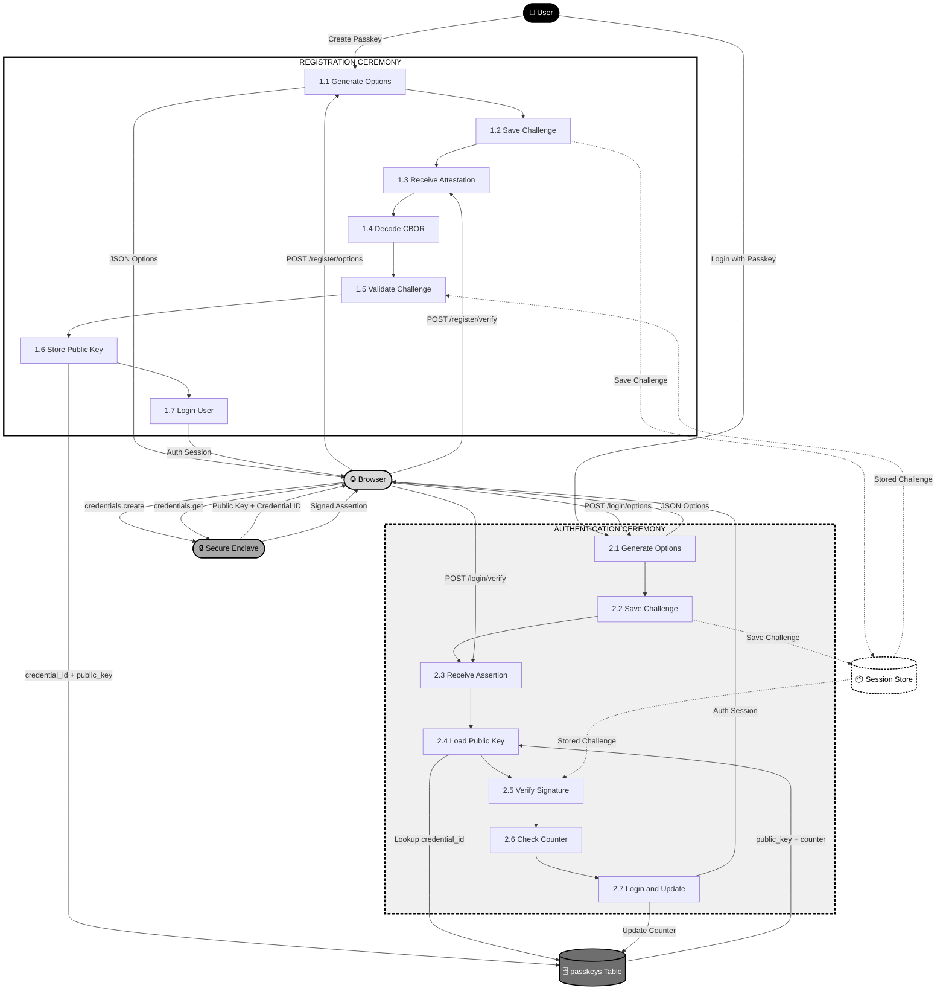

# 🔐 Passkeys — The Complete Beginner-to-Advanced Guide

> **For Laravel developers and anyone learning WebAuthn from scratch.**  
> No passwords. No leaks. Just your fingerprint or face.

---

## 📚 Table of Contents

1. [What is a Passkey?](#what-is-a-passkey)
2. [How It Works — The Simple Version](#how-it-works--the-simple-version)
3. [The Two Keys Explained](#the-two-keys-explained)
4. [The Two Ceremonies](#the-two-ceremonies)
5. [Ceremony 1 — Registration Flow](#ceremony-1--registration-flow)
6. [Ceremony 2 — Authentication Flow](#ceremony-2--authentication-flow)
7. [What the Backend Actually Does](#what-the-backend-actually-does)
8. [Key Concepts Glossary](#key-concepts-glossary)
9. [What Gets Stored in the Database?](#what-gets-stored-in-the-database)
10. [Why Passkeys Are More Secure Than Passwords](#why-passkeys-are-more-secure-than-passwords)
11. [Tech Stack for Laravel 13](#tech-stack-for-laravel-13)
12. [Full Visual Flow Summary](#full-visual-flow-summary)
13. [Pre-Code Checklist](#pre-code-checklist)
14. [Troubleshooting Common Errors](#troubleshooting-common-errors)
15. [Frequently Asked Questions (FAQ)](#frequently-asked-questions-faq)
16. [Further Reading](#further-reading)

---

## What is a Passkey?

A **passkey** is a modern, passwordless way to log in to websites and apps.

It is based on the **WebAuthn standard** (Web Authentication API), a W3C specification supported by all major browsers. Instead of typing a password, your device uses **cryptographic keys** to prove your identity — using Face ID, fingerprint, PIN, or hardware key.

### In one sentence:
> A passkey replaces your password with a **math-based proof** that only your device can generate.

---

## How It Works — The Simple Version

```
1. Your device creates TWO keys — like a lock-and-key pair.
2. The PRIVATE KEY stays locked inside your device. It never leaves.
3. The PUBLIC KEY goes to the server (the website/app).
4. When you log in, the server sends a CHALLENGE (a random puzzle).
5. Your device SOLVES IT using the private key (signs the challenge).
6. The server checks the answer using the stored public key.
7. If it matches → you're in. ✅
```

**No password is ever typed. No password is ever sent over the internet.**  
Even if the server's database is completely leaked, the public key alone is **mathematically useless** to attackers.

---

## The Two Keys Explained

| Key | Where it lives | What it does | Who can see it? |
|---|---|---|---|
| **Private Key** | Your device only (secure enclave) | Signs the challenge to prove identity | Nobody — not even you |
| **Public Key** | Server / database | Verifies the signature | Anyone (it's meant to be public) |

### Analogy: The Wax Seal
- Only you have the **stamp** (private key).
- Anyone can look at the wax impression and confirm it's yours (public key).
- Without the stamp, nobody can forge the seal.

---

## The Two Ceremonies

In WebAuthn language, passkeys have exactly **two flows**, called "ceremonies":

| Ceremony | When it happens | What it does |
|---|---|---|
| **Registration** | Once — when setting up a passkey | Creates the key pair and saves the public key on the server |
| **Authentication** | Every login | Signs a fresh challenge to prove you still have the private key |

> 💡 The word "ceremony" is used because both flows are **formal, structured protocols** with strict validation rules at each step.

---
# 🔐 Passkeys — Complete Step-by-Step Flow

> **Real-world example used throughout this document:**
> - **User:** Hit Adroja (`user_id = 42`)
> - **App:** `https://myapp.com` (Laravel 13 + Spatie Passkeys)
> - **Device:** iPhone 15 with Face ID

---

## 📚 Table of Contents

1. [What Happens at a Glance](#what-happens-at-a-glance)
2. [DFD Level 2 Diagram](#dfd-level-2-diagram)
3. [Registration — Step by Step](#registration--step-by-step)
4. [Authentication — Step by Step](#authentication--step-by-step)
5. [Full Flow Summary](#full-flow-summary)
6. [Data Stored in Database](#data-stored-in-database)
7. [Security Checks at Each Step](#security-checks-at-each-step)

---

## What Happens at a Glance

```
REGISTRATION (one-time setup)          AUTHENTICATION (every login)
──────────────────────────────         ──────────────────────────────
1. Click "Add Passkey"                 1. Click "Login with Passkey"
2. Server sends challenge              2. Server sends NEW challenge
3. Device: Face ID → create keys       3. Device: Face ID → sign challenge
4. Browser sends public key            4. Browser sends signature
5. Server validates & stores key       5. Server verifies signature
6. Logged in ✅                        6. Counter check → Logged in ✅
```

---

## DFD Level 2 Diagram



---

## Registration — Step by Step

> Hit is already logged in with his password and wants to add a passkey
> from his Profile page.

---

### Step 1 — User Clicks "Add Passkey"

**Who acts:** 👤 User → 🌐 Browser

Hit clicks the **"Add Passkey"** button on his profile page. The browser sends:

```http
POST /passkeys/register/options
Content-Type: application/json
X-CSRF-TOKEN: abc123...
```

No body needed — the server identifies the user from the active session.

---

### Step 2 — Server Generates Registration Options (Process 1.1)

**Who acts:** ⚙️ Laravel Server

The server builds a `PublicKeyCredentialCreationOptions` object and returns it:

```json
{
  "rp": {
    "name": "My Laravel App",
    "id":   "myapp.com"
  },
  "user": {
    "id":          "base64(42)",
    "name":        "hit@example.com",
    "displayName": "Hit Adroja"
  },
  "challenge": "k3Fg9mXzP2wQ8nRtLs7vYhJdKbCeAiUo",
  "pubKeyCredParams": [
    { "type": "public-key", "alg": -7   },
    { "type": "public-key", "alg": -257 }
  ],
  "authenticatorSelection": {
    "userVerification": "preferred"
  },
  "timeout": 60000
}
```

| Field | Value | Meaning |
|---|---|---|
| `rp.id` | `myapp.com` | Passkey is locked to this domain only |
| `challenge` | random 32 bytes | One-time puzzle to prevent replay attacks |
| `alg: -7` | ES256 (ECDSA) | Preferred algorithm — used by Apple/Android |
| `alg: -257` | RS256 (RSA) | Fallback — used by Windows Hello |
| `timeout` | 60000ms | User has 60 seconds to complete Face ID |

---

### Step 3 — Challenge Saved to Session (Process 1.2)

**Who acts:** ⚙️ Laravel Server → 📦 Session Store

Before returning the options, the server saves the challenge:

```php
session(['passkey_register_challenge' => 'k3Fg9mXzP2wQ8nRtLs7vYhJdKbCeAiUo']);
```

> ⚠️ **Why session?** The challenge must survive between two separate HTTP
> requests (options request + verify request). The session links them together.
> If the session expires between the two steps, the ceremony will fail.

---

### Step 4 — Browser Calls Device (credentials.create)

**Who acts:** 🌐 Browser → 🔒 Secure Enclave

The browser calls the WebAuthn API:

```javascript
const options = await fetch('/passkeys/register/options', { method: 'POST' });
const credential = await navigator.credentials.create({
    publicKey: options
});
```

The iPhone shows a **Face ID prompt:**

```
┌─────────────────────────────────┐
│   Save a passkey for            │
│   myapp.com?                    │
│                                 │
│   Hit Adroja                    │
│   hit@example.com               │
│                                 │
│   [Cancel]       [Save Passkey] │
└─────────────────────────────────┘
     ↓ Hit taps "Save Passkey"
     ↓ Face ID scans → passes ✅
```

---

### Step 5 — Device Creates Key Pair (Secure Enclave)

**Who acts:** 🔒 Secure Enclave (inside iPhone chip)

The Secure Enclave generates two keys using ECDSA P-256:

```
┌────────────────────────────────────────────────┐
│           SECURE ENCLAVE (iPhone chip)         │
│                                                │
│  Private Key → LOCKED FOREVER inside chip      │
│               Cannot be exported               │
│               Cannot be copied                 │
│               Requires Face ID to use          │
│                                                │
│  Public Key  → Packaged as COSE-encoded blob   │
│               Sent back to browser             │
│                                                │
│  Credential ID → "ABC123xyz...base64url"       │
│               Unique handle for this key pair  │
└────────────────────────────────────────────────┘
```

The device returns an **AttestationObject** (CBOR-encoded binary) containing:
- The new public key
- The credential ID
- Authenticator data (flags, counter=0, RP ID hash)
- Attestation statement (proves key was made in genuine hardware)

---

### Step 6 — Browser Sends Attestation to Server (Process 1.3)

**Who acts:** 🌐 Browser → ⚙️ Laravel Server

```javascript
await fetch('/passkeys/register/store', {
    method: 'POST',
    headers: {
        'Content-Type': 'application/json',
        'X-CSRF-TOKEN': document.querySelector('meta[name=csrf-token]').content
    },
    body: JSON.stringify({
        id:    "ABC123xyz...base64url",
        type:  "public-key",
        response: {
            attestationObject: "o2NmbXRkbm9uZWdhdHRTdG10...",
            clientDataJSON:    "eyJ0eXBlIjoid2ViYXV0aG4u..."
        }
    })
});
```

---

### Step 7 — Server Decodes CBOR (Process 1.4)

**Who acts:** ⚙️ Laravel Server (via web-auth/webauthn-lib)

The `attestationObject` is binary CBOR — the library decodes it:

```php
// Handled internally by spatie/laravel-passkeys + web-auth/webauthn-lib
// What gets extracted:
[
    'fmt'      => 'none',
    'authData' => [
        'rpIdHash'        => sha256('myapp.com'),   // 32 bytes
        'flags'           => 0x45,                  // UP=1, UV=1, AT=1
        'signCount'       => 0,                     // First use = 0
        'credentialId'    => 'ABC123xyz...',
        'credentialPublicKey' => '<COSE EC2 key>'
    ],
    'attStmt'  => []  // empty for fmt=none
]
```

> CBOR is like binary JSON — smaller and faster. You never write this
> decoding code manually. The library handles all of it.

---

### Step 8 — Server Validates Everything (Process 1.5)

**Who acts:** ⚙️ Laravel Server + 📦 Session Store

The server runs 6 mandatory security checks:

```php
// Check 1 — Type must be "webauthn.create"
assert($clientData->type === 'webauthn.create');              // ✅

// Check 2 — Challenge must match session
$stored   = session('passkey_register_challenge');
$received = base64_decode($clientData->challenge);
assert(hash_equals($stored, $received));                      // ✅

// Check 3 — Origin must match your domain
assert($clientData->origin === 'https://myapp.com');          // ✅

// Check 4 — RP ID hash must match
assert($authData->rpIdHash === hash('sha256','myapp.com',true)); // ✅

// Check 5 — User presence flag must be set
assert(($authData->flags & 0x01) === 1);                      // ✅

// Check 6 — User verification must be set (if required)
assert(($authData->flags & 0x04) === 4);                      // ✅
```

If **any check fails** → exception is thrown, registration is blocked.

---

### Step 9 — Public Key Stored in Database (Process 1.6)

**Who acts:** ⚙️ Laravel Server → 🗄️ passkeys Table

```php
Passkey::create([
    'user_id'       => 42,
    'credential_id' => 'ABC123xyz...base64url',
    'public_key'    => $coseEncodedPublicKey,  // binary blob
    'counter'       => 0,
    'device_name'   => 'iPhone 15',
    'created_at'    => now(),
]);
```

**Database row created:**

| user_id | credential_id | public_key | counter | device_name |
|---|---|---|---|---|
| 42 | ABC123xyz... | (COSE blob) | 0 | iPhone 15 |

---

### Step 10 — User Is Logged In (Process 1.7)

**Who acts:** ⚙️ Laravel Server → 🌐 Browser

```php
Auth::login($user);
session()->forget('passkey_register_challenge'); // clean up
return response()->json(['verified' => true]);
```

Browser receives `{ verified: true }` → redirects to `/dashboard`.

**✅ REGISTRATION COMPLETE.**
Hit's iPhone passkey is saved. He will never need to type his password again.

---

## Authentication — Step by Step

> Next day. Hit visits `https://myapp.com/login`. He is not logged in.

---

### Step 1 — User Clicks "Login with Passkey"

**Who acts:** 👤 User → 🌐 Browser

Hit clicks the **"Login with Passkey"** button. No email or password typed.

```http
POST /passkeys/authenticate/options
Content-Type: application/json
X-CSRF-TOKEN: abc123...
```

> The browser may also send the email first so the server knows
> which user's credential IDs to return. Spatie handles this automatically.

---

### Step 2 — Server Generates Auth Options (Process 2.1)

**Who acts:** ⚙️ Laravel Server

The server creates `PublicKeyCredentialRequestOptions`:

```json
{
  "challenge": "Xp7mQ2zR9kLsNtYvBwJdCfAeHgUiOp3q",
  "timeout":   60000,
  "rpId":      "myapp.com",
  "allowCredentials": [
    {
      "type": "public-key",
      "id":   "ABC123xyz...base64url",
      "transports": ["internal"]
    }
  ],
  "userVerification": "preferred"
}
```

| Field | Value | Meaning |
|---|---|---|
| `challenge` | NEW random 32 bytes | Fresh every login — old challenge never reused |
| `allowCredentials` | `["ABC123xyz..."]` | Tells the device exactly which passkey to use |
| `transports: internal` | `"internal"` | Use built-in authenticator (Face ID, not USB key) |

---

### Step 3 — Challenge Saved to Session (Process 2.2)

**Who acts:** ⚙️ Laravel Server → 📦 Session Store

```php
session(['passkey_auth_challenge' => 'Xp7mQ2zR9kLsNtYvBwJdCfAeHgUiOp3q']);
```

> A completely **fresh** challenge every single time.
> Even if an attacker recorded the previous login's data,
> they cannot reuse it because the challenge is different.

---

### Step 4 — Browser Calls Device (credentials.get)

**Who acts:** 🌐 Browser → 🔒 Secure Enclave

```javascript
const options = await fetch('/passkeys/authenticate/options', { method: 'POST' });
const assertion = await navigator.credentials.get({
    publicKey: options
});
```

iPhone shows Face ID again:

```
┌─────────────────────────────────┐
│   Sign in to myapp.com          │
│                                 │
│   Hit Adroja                    │
│   hit@example.com               │
│                                 │
│   [Cancel]       [Sign In]      │
└─────────────────────────────────┘
     ↓ Hit taps "Sign In"
     ↓ Face ID scans → passes ✅
```

---

### Step 5 — Device Signs the Challenge (Secure Enclave)

**Who acts:** 🔒 Secure Enclave

The chip uses the stored private key to sign the challenge:

```
authenticatorData = rpIdHash(32) + flags(1) + signCount(4) + ...
                  = sha256("myapp.com") + 0x05 + 00000008

clientDataHash    = SHA256(clientDataJSON)

signedData        = authenticatorData + clientDataHash

signature         = ECDSA_Sign(privateKey, signedData)
                  = "3045022100f8a3b2..." (DER-encoded, 71 bytes)
```

> The **private key never leaves the chip**.
> Only the signature exits the Secure Enclave.
> Even Apple cannot extract Hit's private key.

The device returns:

```json
{
  "id": "ABC123xyz...",
  "response": {
    "authenticatorData": "base64...",
    "clientDataJSON":    "base64...",
    "signature":         "base64..."
  }
}
```

---

### Step 6 — Browser Sends Assertion to Server (Process 2.3)

**Who acts:** 🌐 Browser → ⚙️ Laravel Server

```javascript
await fetch('/passkeys/authenticate/store', {
    method: 'POST',
    headers: {
        'Content-Type': 'application/json',
        'X-CSRF-TOKEN': document.querySelector('meta[name=csrf-token]').content
    },
    body: JSON.stringify(assertion)
});
```

---

### Step 7 — Server Loads Public Key from DB (Process 2.4)

**Who acts:** ⚙️ Laravel Server → 🗄️ passkeys Table

```php
$passkey = Passkey::where('credential_id', 'ABC123xyz...')->firstOrFail();

// Fetched from DB:
// public_key = <COSE EC2 encoded public key>
// counter    = 7 (last stored value from previous login)
// user_id    = 42
```

`DB → A4` — Returns `public_key` and `counter` to the server process.

---

### Step 8 — Server Verifies Signature (Process 2.5)

**Who acts:** ⚙️ Laravel Server + 📦 Session Store

```php
// Step A — Reconstruct the signed data
$signedData = $authData . hash('sha256', $clientDataJSON, true);

// Step B — Verify ECDSA signature using stored public key
$valid = openssl_verify(
    $signedData,
    $signature,
    $publicKey,
    OPENSSL_ALGO_SHA256
);
assert($valid === 1); // ✅ Mathematically valid

// Step C — Verify challenge matches session
$storedChallenge   = session('passkey_auth_challenge');
$receivedChallenge = base64_decode($clientData->challenge);
assert(hash_equals($storedChallenge, $receivedChallenge)); // ✅

// Step D — Verify origin
assert($clientData->origin === 'https://myapp.com'); // ✅

// Step E — Verify RP ID hash
assert($authData->rpIdHash === hash('sha256', 'myapp.com', true)); // ✅
```

> If the signature is wrong by even **1 bit**, `openssl_verify` returns 0
> and login is blocked. Forging this is computationally impossible without
> the private key.

---

### Step 9 — Counter Check (Process 2.6)

**Who acts:** ⚙️ Laravel Server

```php
$newCounter    = $authData->signCount;  // 8 — sent by device
$storedCounter = $passkey->counter;     // 7 — stored in DB

if ($newCounter <= $storedCounter) {
    // ⛔ BLOCK LOGIN — possible cloned device detected
    throw new Exception('Counter check failed. Possible cloned authenticator.');
}

// ✅ 8 > 7 — counter incremented normally
```

**What the counter proves:**

| Scenario | newCounter | storedCounter | Result |
|---|---|---|---|
| Normal login | 8 | 7 | ✅ Allow — counter went up |
| Replay attack | 7 | 7 | ⛔ Block — same counter reused |
| Cloned device | 3 | 7 | ⛔ Block — counter went down |
| First login | 1 | 0 | ✅ Allow — first use |

---

### Step 10 — Login & Update Counter (Process 2.7)

**Who acts:** ⚙️ Laravel Server → 🗄️ passkeys Table + 🌐 Browser

```php
// Update counter in DB
$passkey->update(['counter' => 8]);

// Log user in
$user = User::find($passkey->user_id);
Auth::login($user);

// Clean up session
session()->forget('passkey_auth_challenge');

return response()->json(['verified' => true]);
```

`A7 → DB` — Counter updated from `7` to `8`.
`A7 → BS` — Browser receives `{ verified: true }` → redirect to `/dashboard`.

**✅ AUTHENTICATION COMPLETE.**
Hit is logged in. No password was typed, transmitted, or stored anywhere.

---

## Full Flow Summary

```
══════════════════════════════════════════════════════════════════════
 REGISTRATION (one-time)
══════════════════════════════════════════════════════════════════════

  Browser                     Server                    Device
  ───────                     ──────                    ──────
  Click "Add Passkey"
       │
       ├── POST /register/options ──────────────────►
       │                           Generate challenge
       │                           Save to session
       │◄── JSON options ──────────────────────────
       │
       ├── navigator.credentials.create(options) ──────────────►
       │                                           Face ID ✅
       │                                           Create key pair
       │                                           Private → stays
       │◄── Public Key + Credential ID ────────────────────────
       │
       ├── POST /register/store ───────────────────►
       │   (attestation object)   Decode CBOR
       │                          Validate challenge ✓
       │                          Validate origin ✓
       │                          Save public key to DB
       │                          Auth::login($user)
       │◄── { verified: true } ────────────────────
  ✅ Registered!

══════════════════════════════════════════════════════════════════════
 AUTHENTICATION (every login)
══════════════════════════════════════════════════════════════════════

  Browser                     Server                    Device
  ───────                     ──────                    ──────
  Click "Login with Passkey"
       │
       ├── POST /authenticate/options ───────────────►
       │                               Generate NEW challenge
       │                               Save to session
       │◄── JSON options ─────────────────────────────
       │
       ├── navigator.credentials.get(options) ────────────────►
       │                                        Face ID ✅
       │                                        Sign challenge
       │                                        with private key
       │◄── Signature + authenticatorData ──────────────────────
       │
       ├── POST /authenticate/store ──────────────────►
       │   (assertion object)        Load public key from DB
       │                             Verify signature ✓
       │                             Check challenge ✓
       │                             Check counter ✓
       │                             Update counter in DB
       │                             Auth::login($user)
       │◄── { verified: true } ─────────────────────
  ✅ Logged in!
```

---

## Data Stored in Database

### `passkeys` table — after Registration

```sql
SELECT * FROM passkeys WHERE user_id = 42;
```

| id | user_id | credential_id | public_key | counter | device_name | created_at |
|---|---|---|---|---|---|---|
| 1 | 42 | ABC123xyz... | (COSE blob) | 0 | iPhone 15 | 2026-04-30 |

### `passkeys` table — after 3 logins

| id | user_id | credential_id | public_key | counter | device_name |
|---|---|---|---|---|---|
| 1 | 42 | ABC123xyz... | (COSE blob) | 3 | iPhone 15 |

> Counter increments by 1 on every successful login.

### User registers a second device (MacBook)

| id | user_id | credential_id | public_key | counter | device_name |
|---|---|---|---|---|---|
| 1 | 42 | ABC123xyz... | (COSE blob) | 3 | iPhone 15 |
| 2 | 42 | DEF456abc... | (COSE blob) | 0 | MacBook Pro |

> One user can have **many passkeys** — one per device.

---

## Security Checks at Each Step

| Step | Check | What it prevents |
|---|---|---|
| 1.5 / 2.5 | Challenge matches session | Replay attacks |
| 1.5 / 2.5 | Origin = `https://myapp.com` | Phishing on fake domains |
| 1.5 / 2.5 | RP ID hash matches | DNS hijacking |
| 1.5 / 2.5 | User presence flag set | Silent/automated attacks |
| 2.5 | ECDSA signature valid | Forgery without private key |
| 2.6 | Counter strictly increasing | Cloned/copied device attacks |
| Both | HTTPS required | Man-in-the-middle attacks |
| Both | Session ties options to verify | Cross-request tampering |

---

*Document version: 1.0 | Laravel 13 + PHP 8.3 + Spatie laravel-passkeys v1*
*Last updated: April 2026*
*Author: Hit Adroja*
---

## Ceremony 1 — Registration Flow

> *"I want to create a passkey for my account."*

```
┌──────────────────────────────────────────────────────────────────────────────────┐
│                         REGISTRATION CEREMONY                                    │
│                                                                                  │
│  BROWSER                    LARAVEL SERVER                  YOUR DEVICE          │
│  ───────                    ──────────────                  ──────────           │
│                                                                                  │
│  1. Click "Create Passkey"                                                       │
│                                                                                  │
│  2. POST /register/options ─────────────────►                                   │
│                              3. Server creates:                                  │
│                                 - Random 32-byte challenge                       │
│                                 - RP entity (app name + domain)                  │
│                                 - User entity (user id, name)                    │
│                                 - Supported algorithms (ES256, RS256)            │
│                              4. Saves challenge to SESSION                       │
│  5. Receives JSON options ◄──────────────────                                   │
│                                                                                  │
│  6. navigator.credentials.create(options) ──────────────────────────►           │
│                                                           7. Prompts Face ID /   │
│                                                              Fingerprint / PIN   │
│                                                           8. Creates key pair:   │
│                                                              - Private key stays │
│                                                              - Returns public    │
│                                                                key + credential  │
│                                                                ID + attestation  │
│  ◄──────────────────────────────────────────────────────────────────────────    │
│                                                                                  │
│  9. POST /register/verify ──────────────────►                                   │
│     (sends attestation + public key)                                             │
│                              10. Server:                                         │
│                                  - Loads challenge from SESSION                  │
│                                  - Decodes CBOR attestation                      │
│                                  - Validates challenge matches                   │
│                                  - Validates origin & RP ID                      │
│                                  - Saves PUBLIC KEY to passkeys table            │
│                                  - Calls Auth::login($user)                      │
│  11. ✅ Registered & logged in ◄─────────────                                   │
└──────────────────────────────────────────────────────────────────────────────────┘
```

### Step-by-step in plain English:

1. User clicks "Create Passkey".
2. Browser asks the server for registration options.
3. Server creates a random challenge and user info, saves to session.
4. Browser calls `navigator.credentials.create()` — this triggers Face ID/Touch ID/PIN on device.
5. Device creates a private key (stays on device) and public key (returned to browser).
6. Browser sends the public key to the server.
7. Server validates everything, saves the public key to the database, logs user in.

---

## Ceremony 2 — Authentication Flow

> *"I want to log in using my passkey."*

```
┌──────────────────────────────────────────────────────────────────────────────────┐
│                         AUTHENTICATION CEREMONY                                  │
│                                                                                  │
│  BROWSER                    LARAVEL SERVER                  YOUR DEVICE          │
│  ───────                    ──────────────                  ──────────           │
│                                                                                  │
│  1. Click "Login with Passkey"                                                   │
│                                                                                  │
│  2. POST /login/options ────────────────────►                                   │
│                              3. Server:                                          │
│                                 - Finds user's credential IDs                    │
│                                 - Generates NEW random challenge                 │
│                              4. Saves challenge to SESSION                       │
│  5. Receives JSON options ◄──────────────────                                   │
│                                                                                  │
│  6. navigator.credentials.get(options) ─────────────────────────────►           │
│                                                           7. Prompts biometric   │
│                                                           8. SIGNS challenge     │
│                                                              with PRIVATE KEY    │
│                                                              Returns: signature  │
│                                                              + authenticatorData │
│  ◄──────────────────────────────────────────────────────────────────────────    │
│                                                                                  │
│  9. POST /login/verify ─────────────────────►                                   │
│     (sends signed assertion)                                                     │
│                              10. Server:                                         │
│                                  - Loads challenge from SESSION                  │
│                                  - Looks up PUBLIC KEY by credential ID          │
│                                  - Verifies SIGNATURE with public key            │
│                                  - Checks challenge matches (replay protection)  │
│                                  - Checks counter > previous (clone detection)   │
│                                  - Calls Auth::login($user)                      │
│                                  - Updates counter in database                   │
│  11. ✅ Logged in! ◄──────────────────────────                                  │
└──────────────────────────────────────────────────────────────────────────────────┘
```

### Step-by-step in plain English:

1. User clicks "Login with Passkey".
2. Browser asks server for a login challenge.
3. Server generates a fresh random challenge, saves to session, returns it with the user's credential IDs.
4. Browser calls `navigator.credentials.get()` — device prompts biometric.
5. Device signs the challenge with the private key, returns the signature.
6. Browser sends the signature to the server.
7. Server verifies the signature using the stored public key, checks security counters, logs user in.

---

## What the Backend Actually Does

### During Registration

| Step | Operation | Details |
|---|---|---|
| 1 | **Generate Options** | Create `PublicKeyCredentialCreationOptions` — includes RP entity (app name/domain), user entity (user id + name), random 32-byte challenge, supported algorithms (ES256, RS256), authenticator selection criteria |
| 2 | **Store in Session** | Serialized options saved to PHP session — needed to verify the response |
| 3 | **Receive Attestation** | Browser sends base64-encoded `AuthenticatorAttestationResponse` — contains new public key + attestation statement |
| 4 | **Decode CBOR** | Library decodes CBOR-encoded (binary JSON) attestation object (`web-auth/webauthn-lib` handles this) |
| 5 | **Validate** | Checks: challenge matches, origin is your domain, RP ID hash is correct, attestation format is trusted |
| 6 | **Store Credential** | Saves `credential_id` and `public_key` (COSE-encoded) to `passkeys` table, linked to `user_id` |
| 7 | **Login User** | Calls `Auth::login($user)` |

### During Authentication

| Step | Operation | Details |
|---|---|---|
| 1 | **Generate Options** | Create `PublicKeyCredentialRequestOptions` — includes new random challenge and list of `allowedCredentials` (user's registered credential IDs) |
| 2 | **Store in Session** | Challenge + options stored in PHP session |
| 3 | **Receive Assertion** | Browser sends `AuthenticatorAssertionResponse` — contains `authenticatorData`, `clientDataJSON`, and `signature` |
| 4 | **Load Credential** | Look up stored public key from `passkeys` table by `credential_id` |
| 5 | **Verify Signature** | Reconstruct signed data (`authenticatorData` + `SHA256(clientDataJSON)`) and verify signature using stored public key via ECDSA or RSA |
| 6 | **Check Counter** | `signCount` from device must be **greater than** stored counter — if not, a cloned device is suspected |
| 7 | **Login User** | Update the counter in DB, call `Auth::login($user)` |

---

## Key Concepts Glossary

### RP (Relying Party)
**That's your Laravel app.** Identified by:
- `APP_NAME` — e.g., `"My Laravel App"`
- Your domain — e.g., `myapp.com`

> The passkey is cryptographically **bound to this domain**. It physically cannot be used on a different domain — so phishing sites with similar-looking URLs will never work.

---

### Challenge
A **random one-time byte string** (32 bytes) generated fresh by the server on every request.

- Sent to the device → device signs it → server verifies the signature.
- **Used only once and never reused.**
- Stored temporarily in the PHP session between the options request and the verify request.

> **Why it matters:** Prevents replay attacks. Even if someone intercepts a signed challenge, they can't reuse it — the server rejects it because it's no longer in the session.

---

### Credential ID
A **unique identifier** for a specific key pair on a specific device.

- One user can register **many passkeys** (phone, laptop, tablet, YubiKey, etc.).
- Each has its own `credential_id`.
- Stored in the `passkeys` table.

---

### COSE Key
The binary format used to encode the public key in the database.

> COSE = **C**oncise **O**bject **S**igning and **E**ncryption (RFC 8152)

You don't decode this manually — libraries like `web-auth/webauthn-lib` handle it.

---

### Counter (Sign Count)
A number that **increments by 1** every time the user authenticates.

- Stored in the database next to the public key.
- On each login, the new counter from the device must be **strictly greater** than the stored counter.
- If equal or lower → **possible cloned/copied device detected** → login blocked.

> **Why it matters:** Protects against attackers who copy a device's credential. If the counter doesn't go up in sequence, something is wrong.

---

### Attestation
Data returned during **registration** that proves the new public key was created inside a genuine authenticator (e.g., Apple Secure Enclave, Android Keystore, YubiKey).

- Can be `none`, `indirect`, or `direct`.
- Most web apps use `none` (skip attestation verification) for simplicity.

---

### Assertion
Data returned during **authentication** that proves you still control the private key.

- Contains: `authenticatorData` + `clientDataJSON` + `signature`.
- The server verifies this signature using the stored public key.

---

### Session Storage
The PHP session acts as **temporary state** between the two steps of each ceremony.

```
Step 1 (options request) → save challenge to session
Step 2 (verify request)  → load challenge from session and compare
```

> ⚠️ Both steps must happen in the **same browser session**. If the session expires between them, the ceremony fails.

---

### Secure Enclave / TEE
The part of your device hardware that stores the private key.

- On Apple devices: **Secure Enclave**
- On Android: **Trusted Execution Environment (TEE)** or **Android Keystore**
- On Windows: **TPM (Trusted Platform Module)**

The private key is generated **inside** this chip and **cannot be exported**. Even if someone physically steals your device, they cannot extract the private key without the biometric or PIN.

---

### CBOR (Concise Binary Object Representation)
A binary encoding format — like JSON but compact and binary.

- Used by WebAuthn to encode the attestation object and authenticator data.
- Handled automatically by `web-auth/webauthn-lib`.

---

## What Gets Stored in the Database?

When a user registers a passkey, you save one row in a `passkeys` table:

```sql
CREATE TABLE passkeys (
    id              BIGINT UNSIGNED AUTO_INCREMENT PRIMARY KEY,
    user_id         BIGINT UNSIGNED NOT NULL,       -- Links to users table
    credential_id   TEXT NOT NULL,                  -- Unique ID for this key pair
    public_key      TEXT NOT NULL,                  -- COSE-encoded public key
    counter         BIGINT UNSIGNED DEFAULT 0,      -- For clone detection
    device_name     VARCHAR(255) NULLABLE,          -- Optional: "iPhone 15 Pro"
    created_at      TIMESTAMP,
    updated_at      TIMESTAMP,
    FOREIGN KEY (user_id) REFERENCES users(id)
);
```

| Column | What it stores | Example |
|---|---|---|
| `user_id` | Which user owns this passkey | `42` |
| `credential_id` | Unique ID for this specific key pair | `base64url string (~88 chars)` |
| `public_key` | COSE-encoded public key | `binary/base64 blob` |
| `counter` | Last known sign count (clone detection) | `7` |
| `device_name` | Optional label | `"MacBook Pro"` |

> 💡 One user can have **multiple rows** — one for each registered device.

---

## Why Passkeys Are More Secure Than Passwords

| Threat | Password | Passkey |
|---|---|---|
| **Database breach** | Passwords (or hashes) stolen | Public key alone is mathematically useless |
| **Phishing attack** | Easy to enter on fake site | Cryptographically bound to exact domain — won't work on fakes |
| **Brute force** | Possible with weak passwords | Impossible — no secret to guess |
| **Keylogger** | Steals typed password | Nothing is typed — nothing to steal |
| **Credential stuffing** | Works if password reused | Every site has a unique key pair |
| **Man-in-the-middle** | Can intercept password | Challenge is domain-specific — interception is useless |
| **Phishing via SMS/OTP** | OTP can be forwarded | Passkey cannot be forwarded — it requires your device biometric |

---

## Tech Stack for Laravel 13

| Layer | Tool | Purpose |
|---|---|---|
| **Backend Package** | `spatie/laravel-passkeys` | Handles all WebAuthn ceremonies |
| **Crypto Library** | `web-auth/webauthn-lib` | Used internally by Spatie — CBOR, COSE, signature verification |
| **Frontend JS** | `@simplewebauthn/browser` | Calls `navigator.credentials.create/get` cleanly |
| **UI** | Blade + Alpine.js | Registration and login UI components |
| **Session** | Laravel default session | Stores challenge between options and verify steps |
| **Database** | MySQL / PostgreSQL | Stores the `passkeys` table |

### Why `spatie/laravel-passkeys`?

- Most **production-ready** and actively maintained Laravel package for passkeys.
- Provides both **Livewire** and **Blade** components out of the box.
- Built on top of the battle-tested `web-auth/webauthn-lib` by Spomky Labs.
- Handles all CBOR decoding, COSE key parsing, and signature verification internally.

---

## Full Visual Flow Summary

```
══════════════════════════════════════════════════════════════════
  REGISTRATION (One-time setup)
══════════════════════════════════════════════════════════════════

  Browser                       Server
  ───────                       ──────
  Click "Create Passkey"
       │
       ├─── POST /register/options ──────────────────────────────►
       │                               Generate challenge
       │                               Save to session
       │◄── JSON options ────────────────────────────────────────
       │
       ├─── navigator.credentials.create(options)
       │         ↳ Device: Face ID / Touch ID / PIN
       │         ↳ Creates private key (stays on device)
       │         ↳ Returns public key + credential ID
       │
       ├─── POST /register/verify ───────────────────────────────►
       │    (public key + attestation)  Validate challenge
       │                               Validate origin & RP ID
       │                               Save public key to DB
       │                               Auth::login($user)
       │◄── { verified: true } ─────────────────────────────────
  ✅ Registered!

══════════════════════════════════════════════════════════════════
  AUTHENTICATION (Every login)
══════════════════════════════════════════════════════════════════

  Browser                       Server
  ───────                       ──────
  Click "Login with Passkey"
       │
       ├─── POST /login/options ─────────────────────────────────►
       │                               Generate NEW challenge
       │                               Save to session
       │◄── JSON options ────────────────────────────────────────
       │
       ├─── navigator.credentials.get(options)
       │         ↳ Device: Face ID / Touch ID / PIN
       │         ↳ Signs challenge with private key
       │         ↳ Returns signature + authenticatorData
       │
       ├─── POST /login/verify ──────────────────────────────────►
       │    (signature + assertion)     Load public key from DB
       │                               Verify signature
       │                               Check challenge matches
       │                               Check counter > previous
       │                               Auth::login($user)
       │                               Update counter in DB
       │◄── { verified: true } ─────────────────────────────────
  ✅ Logged in!
```

---

## Pre-Code Checklist

Before you write a single line of code, verify these requirements:

- [ ] **HTTPS is required** — Passkeys will not work on plain `http://`. This is a hard browser requirement.
- [ ] **Your `APP_URL` in `.env` must exactly match your actual domain** — including `https://` and no trailing slash.
- [ ] **PHP sessions must be working** — Test with a simple session read/write first.
- [ ] **MySQL/PostgreSQL is running** and accessible.
- [ ] **Node.js and npm are available** for `@simplewebauthn/browser`.
- [ ] **Your browser supports WebAuthn** — Chrome 67+, Firefox 60+, Safari 14+, Edge 79+.
- [ ] **Device has a screen lock** set up (PIN, fingerprint, or face) — required for biometric authenticators.
- [ ] **Run migration** to create the `passkeys` table before testing.
- [ ] **`User` model** implements the `HasPasskeys` interface from Spatie's package.
- [ ] **Frontend JS** is compiled and loaded correctly on the page.

---

## Troubleshooting Common Errors

### JavaScript / Browser Errors

#### `NotAllowedError`
**Most common error** — covers multiple scenarios:

| Timing | Most likely cause | Fix |
|---|---|---|
| Error in < 1 second | Environment rejection — page not focused, missing capability | Check HTTPS, ensure user activated the gesture (real click) |
| Error in 1–15 seconds | User dismissed the biometric prompt | Expected — show retry button and fallback option |
| Error in 30+ seconds | Ceremony timed out | Show timeout message, allow retry |

> ⚠️ This error is **intentionally vague** for privacy — browsers don't reveal if a passkey exists or not.

---

#### `SecurityError`
**Configuration problem** — almost always a setup issue.

| Message | Cause | Fix |
|---|---|---|
| `RP ID is not a registrable domain suffix` | `APP_URL` domain doesn't match RP ID | Set RP ID to exactly your domain (e.g. `myapp.com`, not `www.myapp.com`) |
| `Not supported on sites with TLS certificate errors` | HTTP instead of HTTPS, or invalid SSL cert | Use valid HTTPS certificate |
| `publickey-credentials-create feature not enabled` | Inside an iframe without proper permissions | Add `allow="publickey-credentials-create"` to iframe tag |

---

#### `InvalidStateError`
Credential already exists for this device.

| Cause | Fix |
|---|---|
| User trying to register the same device twice | Check `excludeCredentials` — pass all existing credential IDs so the device detects the duplicate gracefully |

---

#### `AbortError`
Your app cancelled the ceremony.

| Cause | Fix |
|---|---|
| Page navigated away during the ceremony | Block navigation until ceremony completes or cancels |
| Two WebAuthn calls made simultaneously | Allow only one in-flight request at a time |

---

#### `ConstraintError`
Device can't satisfy your requirements.

| Cause | Fix |
|---|---|
| Device has no screen lock (PIN/fingerprint) set up | Show a message: "Please set up a screen lock on your device first" |
| `userVerification: "required"` but device doesn't support it | Relax to `"preferred"` |

---

#### `NotSupportedError`
The browser/OS doesn't support what you're requesting.

| Cause | Fix |
|---|---|
| Outdated browser | Show a notice: "Please update your browser to use passkeys" |
| Old OS version without WebAuthn support | Fall back to password authentication |

---

### Laravel / Server Errors

#### Challenge Mismatch
```
Error: Challenge does not match
```
**Cause:** Session expired between the options request and the verify request.

**Fix:**
- Increase session lifetime in `config/session.php`.
- Make sure both requests happen in the same browser session (same tab, not a redirect).
- Don't use stateless API routes for WebAuthn — sessions are required.

---

#### Origin / RP ID Mismatch
```
Error: Origin does not match
```
**Cause:** The `APP_URL` in `.env` doesn't exactly match the URL the user is accessing.

**Fix:**
```dotenv
# .env
APP_URL=https://myapp.com   # Must match EXACTLY what's in the browser address bar
```
- `http://` vs `https://` → Different origins
- `myapp.com` vs `www.myapp.com` → Different origins
- Port mismatch (`myapp.com` vs `myapp.com:8080`) → Different origins

---

#### Invalid Signature / Credential Not Found
```
Error: Invalid signature
```
**Cause:** The credential ID in the request doesn't match any stored passkey, or the stored public key is corrupted.

**Fix:**
- Check that `credential_id` is stored and retrieved correctly (no encoding issues).
- Ensure the public key is stored as-is from the library — don't transform it.
- Rebuild assets with `npm run build` if you changed JS.

---

#### Counter Check Failed
```
Error: Invalid counter
```
**Cause:** The sign count sent by the device is less than or equal to the stored counter — possible cloned device.

**Fix:**
- If this is a genuine user, delete and re-register the passkey.
- If this is happening frequently for legitimate users, check if your counter update is running correctly.
- Some password managers (Bitwarden, 1Password) may sync passkeys across devices and reset counters — consider using `counter = 0` as "counter not supported" rather than hard-blocking.

---

#### `CSRF token mismatch`
```
419 | Page Expired
```
**Cause:** Missing `@csrf` or the CSRF token expired.

**Fix:**
- Add `X-CSRF-TOKEN` header to your fetch/axios calls.
- Ensure the meta tag exists: `<meta name="csrf-token" content="{{ csrf_token() }}">`

---

#### Passkeys Work Locally but Not in Production
**Most common causes:**

1. `APP_URL` is set to `http://localhost` but production uses `https://myapp.com`
2. SSL certificate is self-signed or invalid
3. Nginx/Apache not passing the correct `Host` header
4. Session driver in production is different (e.g., `cookie` instead of `file`)

---

## Frequently Asked Questions (FAQ)

### Q: Can a user have multiple passkeys?
**Yes.** A user can register one passkey per device. Each device generates its own key pair and gets its own `credential_id` row in the `passkeys` table. A single user might have:
- `iPhone 15` passkey
- `MacBook Pro` passkey
- `YubiKey 5` passkey

All of them can log into the same account.

---

### Q: What happens if I lose my device?
The passkey is **tied to the physical device** (or password manager like iCloud Keychain / Google Password Manager). If you lose your device:
- If synced to iCloud/Google: you can recover it from another device signed in to the same account.
- If hardware-only (YubiKey): it's gone — users need a fallback method (password, backup codes).

> Best practice: Always provide a **backup authentication method** (email magic link, recovery code) alongside passkeys.

---

### Q: Are passkeys synced across devices?
**It depends on the platform:**
- **Apple (iCloud Keychain):** Yes — passkeys sync across all Apple devices signed in with the same Apple ID.
- **Google (Google Password Manager):** Yes — synced across Android and Chrome on all platforms.
- **Windows Hello:** No — stored locally on the hardware TPM, not synced.
- **YubiKey / hardware key:** No — hardware-only, physical device required.

---

### Q: Do passkeys work offline?
**Yes.** The biometric verification and signing happen entirely on the device — no internet connection is needed for that step. Only the verification request to your server requires internet.

---

### Q: What if the user's browser doesn't support WebAuthn?
**Check with JavaScript before showing the passkey option:**
```javascript
if (window.PublicKeyCredential) {
    // Show passkey option
} else {
    // Hide passkey option, show password only
}
```

Always provide a **password fallback** for unsupported browsers or devices.

---

### Q: Can passkeys be phished?
**No.** The passkey is cryptographically bound to the **exact domain** (`RP ID`). If a phishing site at `myapp-login.fake.com` tries to use your passkey for `myapp.com`, the browser will refuse — the domain doesn't match. This is one of the strongest security properties of passkeys.

---

### Q: Is HTTPS required?
**Yes, always.** WebAuthn is a browser security feature and is **only available on secure contexts** (`https://`). The one exception is `localhost` for development.

---

### Q: What is the difference between a passkey and a security key (YubiKey)?
| Feature | Passkey (Platform) | Security Key (Cross-Platform) |
|---|---|---|
| **Storage** | Built into your device (phone, laptop) | External hardware (YubiKey, etc.) |
| **Authentication** | Face ID, Touch ID, PIN | Physical touch / NFC |
| **Syncing** | Yes (iCloud, Google) | No — hardware only |
| **Loss risk** | Low (can recover via cloud) | High (device is required) |
| **Use case** | Consumer / everyday users | High-security enterprise |

Both use the **same WebAuthn protocol** — only the authenticator hardware differs.

---

### Q: Why does the backend use CBOR instead of JSON?
CBOR (Concise Binary Object Representation) is a **compact binary format** — smaller than JSON, faster to parse, and supports binary data natively. WebAuthn uses it because public keys and cryptographic data are binary by nature. You don't handle CBOR directly — `web-auth/webauthn-lib` decodes it for you.

---

### Q: What algorithms does WebAuthn support?
| Algorithm | COSE ID | Used by |
|---|---|---|
| **ES256** (ECDSA with SHA-256) | `-7` | Apple, Android, YubiKey (preferred) |
| **RS256** (RSASSA-PKCS1-v1_5) | `-257` | Windows Hello, some enterprise keys |
| **EdDSA** | `-8` | Newer devices / advanced keys |

ES256 is the most widely supported and recommended for new implementations.

---

### Q: Can I use passkeys alongside passwords?
**Yes — and you should.** This is called **progressive authentication**. The recommended approach is:
1. Users sign up with a password (existing flow unchanged).
2. After login, offer: "Add a passkey for faster future logins."
3. On the login page, show both options: "Login with Passkey" + "Use Password".

This gives users choice while gradually migrating to passkeys.

---

### Q: What is `userVerification` and what should I set it to?
Controls whether the device **requires the user to verify identity** (biometric or PIN) during the ceremony.

| Value | Meaning | Recommended for |
|---|---|---|
| `"required"` | Biometric / PIN is **mandatory** | High-security apps (banking, admin) |
| `"preferred"` | Use biometric/PIN **if available** | Most web apps (recommended default) |
| `"discouraged"` | Skip user verification | Legacy hardware keys |

For most Laravel apps, use `"preferred"`.

---

## Further Reading

| Resource | Description |
|---|---|
| [WebAuthn Spec (W3C)](https://www.w3.org/TR/webauthn-3/) | Official standard — the ground truth |
| [passkeys.dev](https://passkeys.dev) | Official beginner-friendly guide |
| [Spatie laravel-passkeys Docs](https://spatie.be/docs/laravel-passkeys/v1/introduction) | Package documentation |
| [SimpleWebAuthn Docs](https://simplewebauthn.dev) | Frontend JS library documentation |
| [Passkey Central](https://www.passkeycentral.org) | Troubleshooting and UX guidance |
| [web-auth/webauthn-lib](https://github.com/web-auth/webauthn-lib) | PHP crypto library (used by Spatie) |
| [MDN WebAuthn API](https://developer.mozilla.org/en-US/docs/Web/API/Web_Authentication_API) | Browser API reference |
| [Google Passkeys Developer Guide](https://developers.google.com/identity/passkeys) | Google's implementation guide |

---

## Quick Reference Card

```
┌─────────────────────────────────────────────────────┐
│              PASSKEYS QUICK REFERENCE                │
├─────────────────────────────────────────────────────┤
│  Standard:       WebAuthn (W3C) / FIDO2             │
│  Package:        spatie/laravel-passkeys            │
│  Frontend:       @simplewebauthn/browser            │
│  Requires:       HTTPS (always)                     │
│  Session:        PHP session (both ceremonies)      │
├─────────────────────────────────────────────────────┤
│  REGISTRATION ENDPOINTS                             │
│    GET/POST  /passkeys/register/options             │
│    POST      /passkeys/register/verify              │
├─────────────────────────────────────────────────────┤
│  AUTHENTICATION ENDPOINTS                           │
│    GET/POST  /passkeys/authenticate/options         │
│    POST      /passkeys/authenticate/verify          │
├─────────────────────────────────────────────────────┤
│  KEY DATABASE COLUMNS                               │
│    user_id, credential_id, public_key, counter      │
├─────────────────────────────────────────────────────┤
│  COMMON ERRORS                                      │
│    NotAllowedError → User cancelled or no HTTPS     │
│    SecurityError   → RP ID / domain mismatch        │
│    InvalidStateError → Duplicate credential         │
│    AbortError      → Concurrent requests / nav      │
└─────────────────────────────────────────────────────┘
```

---

*Document version: 1.0 | Laravel 13 + PHP 8.3 + Spatie laravel-passkeys v1*  
*Last updated: April 2026*  
*Author: Hit Adroja | Based on WebAuthn W3C Spec Level 3*
