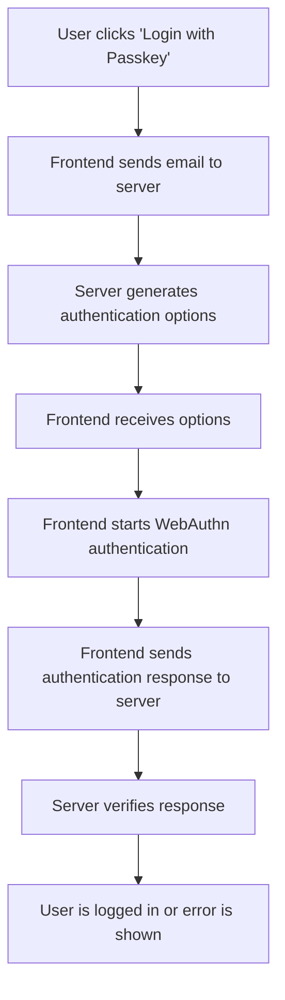

# Passkey Login Flow

This document explains the flow of the Passkey Login functionality in the application.

## Overview
The Passkey Login functionality allows users to authenticate using WebAuthn passkeys. This feature is implemented using the `Spatie\LaravelPasskeys` package and involves both backend and frontend components.

---

## Flow Diagram



---

## Backend Components

### Routes
The following routes are defined for Passkey Login:

- **Authentication Options**: `POST /passkeys/authentication-options`
  - Controller: `GeneratePasskeyAuthenticationOptionsController`
  - Name: `passkeys.authentication_options`

- **Authenticate**: `POST /passkeys/authenticate`
  - Controller: `AuthenticateUsingPasskeyController`
  - Name: `passkeys.authenticate`

### Controller
The `PasskeyController` handles passkey registration and storage. Key methods include:

- `registerOptions(Request $request)`
  - Generates passkey registration options.
  - Stores options in the session.

- `store(Request $request)`
  - Validates and stores the passkey.
  - Uses `StorePasskeyAction` to execute the storage.

---

## Frontend Components

### Login Page
The login page includes a button for Passkey Login:

```html
<button type="button" id="passkey-login-btn" class="btn btn-dark" onclick="loginWithPasskey()">
    <span id="passkey-spinner">⏳</span>
    🔑 Login with Passkey
</button>
```

### JavaScript
The `loginWithPasskey` function handles the Passkey Login process:

1. Sends the user's email to the server to fetch authentication options.
2. Starts WebAuthn authentication using the options.
3. Sends the authentication response to the server for verification.

Example:

```javascript
async function loginWithPasskey() {
    const email = document.getElementById('email').value.trim();
    const optRes = await fetch('{{ route('passkeys.authentication_options') }}', {
        method: 'POST',
        headers: {
            'Content-Type': 'application/json',
            'X-CSRF-TOKEN': document.querySelector('meta[name="csrf-token"]').content,
        },
        body: JSON.stringify({ email })
    });

    const options = await optRes.json();
    const authentication = await window.startAuthentication({ optionsJSON: options });

    const verifyRes = await fetch('{{ route('passkeys.authenticate') }}', {
        method: 'POST',
        headers: {
            'Content-Type': 'application/json',
            'X-CSRF-TOKEN': document.querySelector('meta[name="csrf-token"]').content,
        },
        body: JSON.stringify(authentication)
    });

    if (verifyRes.ok) {
        window.location.href = '{{ route('dashboard') }}';
    } else {
        alert('Login failed.');
    }
}
```

---

## Conclusion
The Passkey Login functionality integrates WebAuthn for secure and passwordless authentication. It involves both backend and frontend components, ensuring a seamless user experience.
